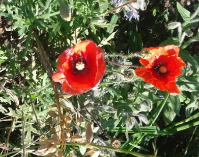
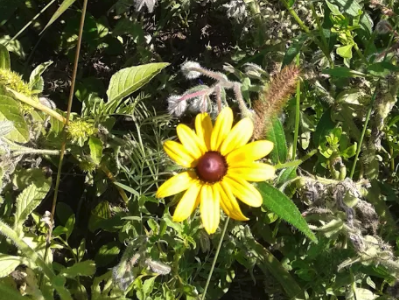

We offer a line of flower mixes that allow bees to feed from spring to fall.

In addition to helping bees directly, these plants also promote other areas of the ecosystem, such as  beneficial insects, butterflies and hummingbirds. 

Each choice of flower contributes to a unique honey flavour profile. 

Deer resistant flower mixes are also available.

We generally plant 125g of flower mix per 90 square meters. These mixes are a great solution to bringing back life into your backyards, fields and municipalities. Please [contact us](./contact/) for more information.

  

    

      
      

        
Poppy

      

    

  

  

    

      
      

        
Brown eyed Susan

      

    

  

<table class="table price-table">
<tr><td>name</td><td>25g</td><td>125g</td><td>250g</td><td>500g</td><td>1kg</td><td>5 kg (per kg)</td></tr>
<tr><td>Standard Wildflower Mix</td><td>  7.91</td><td>  23.29</td><td>  37.20</td><td>  55.83</td><td>  109.25</td><td>98/kg</td></tr>
<tr><td>Perennial Wildflower Mix</td><td>  9.03</td><td>  27.95</td><td>  41.86</td><td>  65.09</td><td>  118.45</td><td>105/kg</td></tr>
<tr><td>Low Grow Mix</td><td>  9.03</td><td>  27.95</td><td>  41.86</td><td>  65.09</td><td>  118.45</td><td>105/kg</td></tr>
<tr><td>Semi-Shade Wildflower Mix</td><td>  10.15</td><td>  32.60</td><td>  46.52</td><td>  74.41</td><td>  126.50</td><td>115/kg</td></tr>
<tr><td>Deer Resistant Wildfower Mix</td><td>  10.15</td><td>  32.60</td><td>  46.52</td><td>  74.41</td><td>  126.50</td><td>115/kg</td></tr>
<tr><td>Butterfly Mix</td><td>  9.03</td><td>  27.95</td><td>  41.86</td><td>  65.09</td><td>  118.45</td><td>105/kg</td></tr>
<tr><td>Hummingbird Mix</td><td>  9.03</td><td>  27.95</td><td>  41.86</td><td>  65.09</td><td>  118.45</td><td>105/kg</td></tr>
<tr><td>Beneficial Insect Mix</td><td>  10.50</td><td>  39.39</td><td>  59.80</td><td>  90.28</td><td>  143.75</td><td>135/kg</td></tr>
<tr><td>Bee Pollinator Mix</td><td>  11.62</td><td>  44.85</td><td>  63.25</td><td>  102.35</td><td>  164.16</td><td>155/kg</td></tr>
</table>

For more information, please [contact us](/contact).
